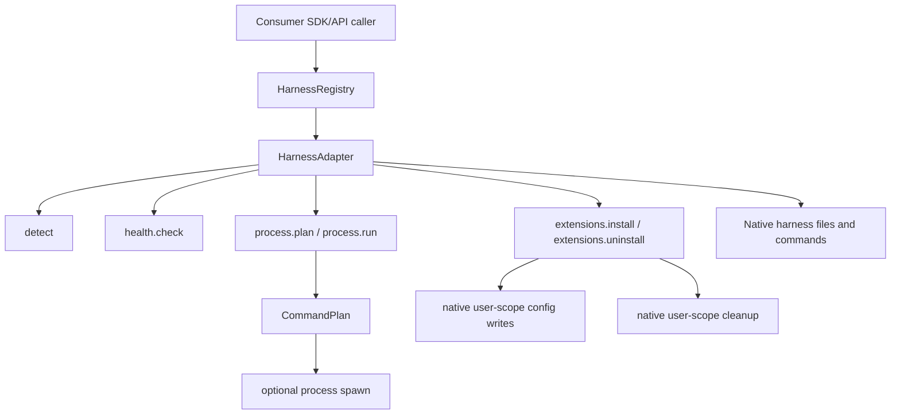

# @plimeor/harness SDK 架构计划

来源需求：`docs/requirements/2026-06-24-harness-sdk-requirement.md`。

## 推荐方向

`@plimeor/harness` 应实现为 library-only SDK。核心包只拥有稳定基础设施：

- adapter registry
- detection
- health reports
- command planning
- thin process execution
- harness extension install/uninstall dispatch

包内 concrete adapter 通过独立模块随包发布，并在 import 时向 registry self-register。

具体 CLI 的 binary 名称、flags、配置路径、权限语义、MCP 布局、hooks、skills 和
native plugin 输出都由 adapter 拥有。

第一批内置 adapter：

| Adapter | CLI command | Output modes | User-scope extension resources |
| --- | --- | --- | --- |
| `codex` | `codex` | `text`, `jsonl`, `structured` | skills, MCP servers, hooks |
| `claude` | `claude` | `text`, `jsonl`, `structured` | skills, MCP servers, hooks |
| `kiro` | `kiro-cli` | `text` | skills, MCP servers, hooks |
| `pi` | `pi` | `text`, `jsonl` | skills |

## 架构图



## 核心原则

任何会写文件、运行 setup 命令、注册 MCP server、安装 skill、安装 hook 或修改
harness 配置的操作，都由对应 adapter 的
`extensions.install` / `extensions.uninstall` 拥有。

Core 不提供文件写入 executor，也不定义跨 harness 配置变更记录机制。Adapter 负责验证
所有权、处理冲突、执行 native 配置写入，并在无法安全处理时返回 unsupported 或
conflict。

## V0 范围

V0 只实现以下公共面：

- `HarnessRegistry`
- `HarnessAdapter`
- `detect`
- `health.check`
- `process.plan`
- `process.run`
- `extensions.install`
- `extensions.uninstall`
- built-in adapter self-registration modules

Out of scope:

- full capability negotiation DSL
- native plugin abstraction
- broad health issue object model
- hook lifecycle normalization
- cross-harness permission enum

## Harness Registry

```ts
export type HarnessRegistry = {
  use(adapter: HarnessAdapter): void
  list(): HarnessAdapter[]
  detectAll(context?: HarnessContext): Promise<HarnessDetection[]>
  open(id: HarnessId, context?: HarnessContext): Promise<HarnessHandle>
}

export declare const harness: HarnessRegistry
```

## Adapter Contract

```ts
export type HarnessId = 'claude' | 'codex' | 'kiro' | 'pi' | (string & {})

export type HarnessContext = {
  /** Default working directory for adapter operations; relative extension paths resolve from here. */
  cwd?: string
  /** Base environment available to detection, planning, and adapter-owned native commands. */
  env?: Record<string, string | undefined>
  /** User home directory used for user-scope native config resolution. */
  home?: string
}

export type HarnessAdapter = {
  id: HarnessId
  detect(context?: HarnessContext): Promise<HarnessDetection>
  open(context?: HarnessContext): Promise<HarnessHandle>
}

export type HarnessHandle = {
  detection: HarnessDetection
  health: HealthFacet
  process: ProcessFacet
  extensions: ExtensionFacet
}
```

## Detection

```ts
export type HarnessDetection = {
  id: HarnessId
  detected: boolean
  binary?: {
    /** Executable name or path used to invoke the detected harness CLI. */
    command: string
    /** Adapter-verified identity string, such as a version or product marker. */
    identity?: string
  }
}
```

Detection 需要验证 identity，而不只检查命令是否存在。

## Health

```ts
export type HealthFacet = {
  check(): Promise<HealthReport>
}

export type HealthReport = {
  success: true
} | {
  success: false
  message: string
}
```

Health 检查 CLI 是否安装，以及 CLI 是否能响应一次 adapter-owned smoke prompt。
Codex 和 Claude 在执行 smoke prompt 前先检查本地是否能访问 `google.com`。无法访问
`google.com` 时返回 `success: false` 和网络不可达 message，且不执行 smoke prompt。
`success: true` 表示对应 adapter 的检查都通过。`success: false` 时，`message` 由
adapter 生成，用于给用户展示未安装、安装方式、网络不可达，或 smoke prompt 在指定
时间内没有响应。

## Process Planning

`process.run` 属于 core，因为任务执行场景需要 SDK 直接启动目标 CLI。
`process.plan` 是 `run` 的可审查前置产物。

V0 的 process contract 覆盖以下 normalized run 语义：

- spawn command
- stdin/stdout/stderr IO
- exit code
- signal
- kill
- timeout
- output mode decoding
- `HarnessRunEvent`
- `HarnessRunResult`
- `finalText`
- structured validation

Run non-goals:

- cross-harness permission enum
- unified session lifecycle
- TTY-specific behavior

```ts
import type { StandardSchemaV1 } from '@standard-schema/spec'

export type ProcessFacet = {
  plan<Output extends RunOutputRequest = TextOutputRequest>(request: RunRequest<Output>): Promise<CommandPlan<Output>>
  run<Output extends RunOutputRequest = TextOutputRequest>(request: RunRequest<Output>): Promise<HarnessRun<Output>>
  run<Output extends RunOutputRequest = TextOutputRequest>(plan: CommandPlan<Output>): Promise<HarnessRun<Output>>
}

export type RunRequest<Output extends RunOutputRequest = TextOutputRequest> = {
  prompt: string
  /** Requested working directory before adapter resolution. */
  cwd?: string
  stdin?: string | Uint8Array
  /** Process environment patch requested by the caller for this run. */
  env?: Record<string, string | undefined>
  /** Defaults to text output when omitted. */
  output?: Output
  timeoutMs?: number
}

export type RunOutputRequest =
  | TextOutputRequest
  | JsonlOutputRequest
  | StructuredOutputRequest

export type TextOutputRequest = { mode?: 'text' }

export type JsonlOutputRequest = { mode: 'jsonl' }

export type StructuredOutputRequest<Schema extends StandardSchemaV1 = StandardSchemaV1> = {
  mode: 'structured'
  schema: Schema
}

export type CommandPlan<Output extends RunOutputRequest = TextOutputRequest> = {
  harnessId: HarnessId
  /** Executable name or path to spawn; arguments stay in args. */
  command: string
  args: string[]
  /** Resolved working directory used by process.run. */
  cwd: string
  /** Process environment patch: string sets a variable, undefined removes it. */
  env?: Record<string, string | undefined>
  stdin?: string | Uint8Array
  output: Output
  timeoutMs?: number
}

export type HarnessRun<Output extends RunOutputRequest = TextOutputRequest> = {
  plan: CommandPlan<Output>
  stdout: AsyncIterable<Uint8Array>
  stderr: AsyncIterable<Uint8Array>
  events: AsyncIterable<HarnessRunEvent>
  result: Promise<HarnessRunResult<Output>>
  kill(signal?: string): void
}

export type HarnessRunEvent =
  /** Normalized text emitted by the harness. */
  | { type: 'text'; text: string }
  /** Parsed JSON object emitted by jsonl or structured output modes. */
  | { type: 'json'; value: unknown }

export type HarnessRunResult<Output extends RunOutputRequest = TextOutputRequest> = {
  exitCode: number | null
  signal?: string
  finalText: string
} & StructuredRunResult<Output>

export type StructuredRunResult<Output extends RunOutputRequest> =
  Output extends StructuredOutputRequest<infer Schema>
    ? { structured: StandardSchemaV1.InferOutput<Schema> }
    : { structured?: never }

export type HarnessRunOutputError = Error & {
  name: 'HarnessRunOutputError'
  kind: 'json_parse_failed' | 'structured_validation_failed'
  outputMode: 'jsonl' | 'structured'
  finalText: string
  exitCode: number | null
  signal?: string
  cause: unknown
}
```

`process.run` 接受 `RunRequest` 或 `CommandPlan`。传入 `RunRequest` 时，adapter
先生成 `CommandPlan` 再执行；传入 `CommandPlan` 时，`run` 必须执行调用方传入的
plan，不得重新规划 command、args、cwd、env 或 stdin。调用方需要审查命令时，先调用
`process.plan`，再将同一个 plan 交给 `run`。

`ProcessFacet.run` 必须拒绝 `plan.harnessId` 与当前 handle 不一致的 plan，避免把
一个 adapter 生成的 command plan 交给另一个 adapter 执行。

`CommandPlan.env` 是对调用方进程环境的 patch：`string` 表示设置变量，
`undefined` 表示删除变量。`CommandPlan.cwd` 由 adapter 解析为实际运行目录，避免
spawn 时再隐式继承未知 cwd。`CommandPlan.timeoutMs` 是最终执行超时。传入
`CommandPlan` 时，`run` 不从原始 `RunRequest` 读取隐藏状态。

权限和 sandbox 行为保持 adapter-owned。Core 不定义 `read-only`、`workspace-write`
之类跨 CLI 承诺型 enum。无法编译为目标 CLI flags 的请求应由 adapter 直接抛出
typed error；带警告的 plan 不属于有效结果。

JSONL、structured output 和最终文本提取属于 core contract。Adapter
负责提供目标 CLI 的 native output 映射，使 `process.run` 能产生
`HarnessRunEvent`、`finalText` 和 `HarnessRunResult`；structured output 使用
`StandardSchemaV1`，成功时写入按 schema 推导的必填 `structured`。无法支持请求的
output mode 时，adapter 在 `plan` 阶段抛出 typed error。

当调用方请求 structured output，但进程输出无法解析为 JSON，或解析结果无法通过
`StandardSchemaV1` 校验时，`HarnessRun.result` 必须 reject `HarnessRunOutputError`。
该错误保留 `finalText`、`exitCode`、`signal`、`outputMode` 和原始 `cause`，供调用方
展示或调试。该失败不降级为 text result，也不返回缺失 `structured` 的成功结果。
JSONL 模式的 JSON 解析失败也使用同一错误类型，并通过 `outputMode` 区分来源。

## Harness Extensions

`HarnessExtension` 表示可移植集成意图；native plugin 语义由 adapter 拥有。Adapter
负责把 extension 安装到目标 harness 的 user-scope native 配置中，并负责卸载。

```ts
export type ExtensionFacet = {
  check(extension: HarnessExtension): Promise<ExtensionCheckResult>
  install(extension: HarnessExtension): Promise<ExtensionResult>
  uninstall(extensionId: string): Promise<ExtensionResult>
}

export type HarnessExtension = {
  /** Stable extension id used by adapter-owned install records and uninstall. */
  id: string
  resources: ExtensionResources
}

export type ExtensionResources = {
  /** Filesystem paths to skill files or directories; relative paths resolve from HarnessContext.cwd. */
  skills?: string[]
  hooks?: HookResource[]
  mcpServers?: Record<string, McpServerResource>
}

export type ExtensionResourceKind = keyof ExtensionResources

export type McpServerResource = {
  /** Executable name or path for the stdio MCP server; arguments stay in args. */
  command: string
  args?: string[]
  /** Environment variables added for this MCP server process. */
  env?: Record<string, string>
}

export type HookResource = {
  /** Stable hook resource name within this extension. */
  name: string
  /** Native hook event name validated by the adapter. */
  event: string
  /** Command string installed into the target harness native hook config. */
  command: string
}

export type ExtensionResult = {
  success: boolean
  issues: ExtensionIssue[]
}

export type ExtensionCheckResult = {
  compatible: boolean
  issues: ExtensionIssue[]
}

export type ExtensionIssue =
  | { kind: 'unsupported'; resourceKind: ExtensionResourceKind; resourceName?: string; reason: string }
  | { kind: 'conflict'; resourceKind?: ExtensionResourceKind; resourceName?: string; reason: string }
```

`ExtensionResult.success` 表示 install/uninstall 是否完成。`issues` 非空表示 adapter
未完成安装或卸载；adapter 不得在已知 unsupported/conflict 的情况下继续做部分写入。
`ExtensionIssue.resourceName` 指向对应 resource 的 key 或稳定标识：skill 使用路径，
MCP server 使用 `mcpServers` 的 server name，hook 使用 `HookResource.name`。

`extensions.check()` 是只读 compatibility check，只验证 adapter 是否支持 resources 中
声明的资源类型，以及 `HookResource.event` 是否属于该 adapter 的官方 hook event 列表。
它不读取本地 skill 路径、不检查 native 配置冲突、不调用 native CLI，也不写任何文件。

调用方传入的 extension id 和 native resource name 承担 namespace 前缀。Adapter 不为
业务资源发明额外命名空间；adapter state 只记录这些 caller-owned names 对应的
ownership proof。

Hooks 由目标 harness 执行，不由 `@plimeor/harness` runtime 执行。Adapter 负责把
`HookResource` 安装到目标 CLI 的 native hook 配置中；`event` 是 adapter 验证的
native hook event 名称。目标 CLI 在对应事件发生时运行 hook command。

`skills` 是待安装 skill 的文件系统路径列表；相对路径基于 `HarnessContext.cwd` 解析。
`mcpServers` 是 server name 到 stdio server 配置的映射；`command` 是可执行命令，
`args` 是参数数组，`env` 是该 server 进程的环境变量补充。

Extension install/uninstall 面向 user scope。Project scope 不属于该计划范围。Adapter
使用 `HarnessContext.home` 或运行环境中的 user home 解析目标位置。

Extension install 是 all-or-nothing。Preflight 发现任何 unsupported、unsupported hook
event、目标路径冲突、MCP server 冲突、hook 冲突或既有 ownership proof 不匹配时，
adapter 返回 `issues` 并且不执行 native 写入。Install 过程中已经写入并记录 proof 的
资源会在失败时 rollback。

Extension uninstall 先验证 state 中记录的 ownership proof。Skills 验证 symlink target，
JSON/TOML MCP 配置验证对应 native entry 或 marker block 的 hash，hook 配置验证 native
hook group 或 hook 文件 hash。Proof 缺失表示资源已不存在；proof 不匹配表示资源被外部
修改，adapter 返回 conflict 并且不删除该资源。

Adapter 直接写入 JSON/TOML 配置时使用同目录临时文件加 atomic rename；native CLI 写入
保留目标 CLI 的写入语义，adapter 在写入后读取 native config 生成 proof。每个 adapter
config directory 使用 `.harness-extensions.lock` 串行化 SDK 发起的 install/uninstall。

## 边界和升级条件

- 权限、sandbox 或 session 参数保持 adapter-owned；这些关注点的扩展点是
  adapter-specific typed helpers。
- `ExtensionResult.success` 和 `issues` 只表达 install/uninstall 的 unsupported 和 conflict 结果；
  capability negotiation DSL 不属于 V0。
- 原生资源类型提升到 core 需要独立的兼容性决策和跨 adapter 稳定 invariant。
- Health report 面向用户展示。机器过滤和聚合需要明确结构化字段；自由文本日志不作为
  core health 结构。
